# Pipeline-Refactoring-Plan: Intake-Pipeline + Review-UI

Koch, Schatz & Kollegen · Stand: 2026-07-07 · Schema-Version 45
Zielarchitektur: `extraktions-pipeline-v7.mermaid`
Status: **Planungsdokument — keine Implementierung. Freigabe durch RA Schatz erforderlich.**

Nicht verhandelbare Design-Entscheidungen (aus v7):
1. **Kein Auto-Bucket.** Jedes Dokument läuft durch die Review-UI. Die menschliche Freigabe ist die einzige Schreiboperation Richtung Akte. Alle Pipeline-Signale sind Konfidenz-Hinweise, kein Routing.
2. **Strikte Trennung DOKUMENT vs. ZUSTELLUNG.** Dokument = hash-dedupliziert, Payload + Ergebnisse. Zustellung = n:1 auf Dokument, wird nie gelöscht, trägt Quelle/Absender/Auth-Status/Signale. Klassifikation nutzt die Vereinigung aller Zustellungssignale.
3. **Reklassifizierung ist eine UI-Aktion:** Mensch setzt Klasse → Re-Parse mit korrektem Registry-Eintrag → Ergebnis zurück in die UI.
4. **RA-MICRO bleibt.** Output als dünner, testbar gekapselter Adapter (XML-Scanner-Schnittstelle), keine Migrationsschicht.
5. **Korrektur-Log ab Tag 1** (Feld, Wert alt/neu, Klasse, Registry-Version).

---

## 1. Ist-Zustand

Tatsächlicher Ablauf im Code (Stand 2026-07-07). Jeder Knoten mit Datei + Funktion. Keine Bewertung.

```mermaid
flowchart TD
    subgraph EINTRITT [Eintrittspunkte]
        E1[IMAP-Polling<br/>polling_service.py: fuehre_polling_durch<br/>APScheduler 60s, Intervall je Konto<br/>aus imap_polling_config]
        E2[Manueller Import<br/>email_routes.py: POST /email/import]
        E3[Upload<br/>dokumente_routes.py: POST /akten/az/dokumente<br/>upload_service.py: Validierung, UUID-Name]
        E4[E-Akte-Pull<br/>eakte_routes.py: importieren<br/>eakte_service.py: hole_eakte_dokumente<br/>read-only aus raEloakte]
        E5[PDF-Parse manuell<br/>pdf_parse_routes.py: POST /akten/az/parse-pdf]
    end

    E1 --> M1
    E2 --> M1
    M1[import_service.py: fuehre_import_lauf_durch<br/>imap_client.py: imap_verbinden + hole_ungelesene<br/>UID SEARCH UNSEEN, max 50]
    M1 --> M2[email_parser.py: parse_email<br/>Header, Body Text/HTML, UTF-16-BOM-Workaround,<br/>Anhänge PDF/DOCX/JPG/PNG,<br/>AZ-Regex 3 Muster, KFZ-Regex]
    M2 --> M3{Duplikat?<br/>import_service.py: nur message_id<br/>gegen email_import_log}
    M3 -->|Ja| M3a[Status ignoriert, als gelesen markiert<br/>KEINE Signal-Vereinigung]
    M3 -->|Nein| M4{Fragebogen?<br/>import_service.py: _ist_fragebogen_email}
    M4 -->|Ja| M4a[fragebogen_parser.py<br/>mit AZ: _ergaenze_mandant/gegner/...<br/>ohne AZ: fragebogen_erstkontakt-Stub]
    M4 -->|Nein| M5[email_parser.py: finde_akte<br/>1. AZ-LIKE gegen unfallakte.az<br/>2. KFZ gegen beteiligte<br/>3. Absender-Mail gegen beteiligte<br/>+ email_matching.py: suche_akte_in_ramicro<br/>First Match, KEIN Score]
    M5 --> M6[Domain-Lookup email_absender_vorlagen<br/>import_service.py Z.324-344<br/>→ absender_kategorie, versicherer_name<br/>KEINE Vertrauensstufe]
    M6 --> M7[klassifizierer.py: klassifiziere_email<br/>Stufe 0 Betreff-Gutachten → Stufe 1 PDF-Typ →<br/>Stufe 2 Absender-Kategorie → Stufe 3 Betreff-Regex →<br/>Stufe 4 neues_mandat → sonstiges]
    M7 --> M8{Akte gefunden?}
    M8 -->|Ja| M9[AUTO-PFAD: speichere_anhang + registriere_dokument<br/>→ dokumente-Zeile + starte_pdf_parsing<br/>OHNE menschliche Prüfung]
    M8 -->|Nein| M10[Status nicht_zugeordnet]
    M9 --> M11[.eml speichern UPLOAD_DIR/uuid_msgid.eml<br/>email_import_log-INSERT<br/>IMAP-Verschiebung UA_Eingang nur Konto unfall]
    M10 --> M11
    M4a --> M11

    E3 --> D0
    E4 --> D0
    E5 --> D0
    M9 --> D0
    D0[workflow/dispatcher.py: dispatch_dokument]
    D0 --> D1{SHA-256-Duplikat?<br/>_pruefe_duplikat: pdf_hash NUR innerhalb<br/>derselben Akte, kein UNIQUE-Constraint}
    D1 -->|Ja| D1a[_kopiere_parse_ergebnis<br/>parse_status=kopiert, Konfidenz 1.0<br/>zweites Dokument bleibt eigene Zeile]
    D1 -->|Nein| D2[pdf/extraktor.py: extrahiere_pdf<br/>NUR pdfplumber, kein PyMuPDF<br/>Seite mit unter 5 Wörtern = Bild,<br/>gesamt unter 20 Wörter = gescannt<br/>KEIN Zeichensalat-Check, KEIN Deskew]
    D2 --> D3{Text unter 50 Zeichen<br/>und Bild-PDF?}
    D3 -->|Ja| D4[ocr_service.py: ocr_text<br/>pytesseract.image_to_string, 300 DPI, deu<br/>KEIN image_to_data, KEIN TSV<br/>SSE-Fortschritt seitenweise]
    D3 -->|Nein| D5
    D4 --> D5{Text unter 20 Zeichen?}
    D5 -->|Ja| D5a[parse_status=fehler UNDEFINIERT:<br/>kein Retry, keine Dead-Letter-Queue,<br/>Dokument bleibt stehen]
    D5 -->|Nein| K1[Stufe 1a: _domain_lookup Konfidenz 0.98<br/>Stufe 1b: _registry_lookup Marker in Text<br/>0.95 eindeutig / 0.92 Domain-Vorrang / 0.60 Konflikt<br/>Stufe 1c: document_classifier.py: classify_document<br/>Signal-Scores pb/ab/gt/rg/sv_rg]
    K1 --> K2[dispatcher.py: _entscheide_klasse<br/>Konflikt-Auflösung, Gutachten-Guard nur PDF]
    K2 -->|keine Klasse| K3[workflow/escalation.py: eskaliere_dokument<br/>→ System-Todo, parse_status=ausstehend]
    K2 -->|Klasse + Konfidenz ab 0.70| P1[_PARSER_MAP → Parser<br/>parsers/gutachten_parser, abrechnungsschreiben_parser,<br/>pruefbericht_parser, rechnung_parser<br/>Regex primär]
    K2 -->|Konfidenz unter 0.70| K4[Parser übersprungen<br/>parse_status=ausstehend]
    P1 --> P2[llm_service.py: Qwen Shadow-Mode<br/>LM Studio, temp 0.0, Text auf 10.000 Zeichen gekürzt<br/>Ergebnis als llm_*-Felder NEBEN Regex<br/>llm_konflikt-Flag, Regex bleibt führend<br/>Timeout 60s → still None, kein Retry]
    P2 --> P3[dokumente-UPDATE: dokumentenklasse,<br/>parse_json, parse_status, parse_konfidenz<br/>KEIN Registry-/Modell-Versionsstempel]
    P3 --> A1{Konfidenz ab 0.85?<br/>upload_service.py Z.185}
    A1 -->|Ja| A2[AUTO-IMPORT in schadenpositionen<br/>ohne menschliche Freigabe]
    A1 -->|Nein| A3[wartet auf manuelle Sichtung]

    subgraph FRONTEND [Heutiges Review-Frontend]
        F1[EmailImportView.jsx: 3 Tabs unfall/termin/bussgeld]
        F2[UnfallEmailView.jsx: Aktionspflichtig-Block<br/>nicht_zugeordnet + Fragebogen,<br/>Stream mit Zeitgruppen, Kategorie-Chips, Suche<br/>KEINE Konfidenz-Sortierung, keine Fristen-Priorität]
        F3[EmailDetailView.jsx: Metadaten links,<br/>PDF als nacktes iframe rechts<br/>KEINE Bounding-Boxes, keine Feld-Anzeige]
        F4[EmailKarte.jsx: Akte zuordnen via Suche<br/>email_routes.py: GET /email/import/aktensuche<br/>RA-Micro TOP 20 + SQLite-Fallback]
        F5[InAkteButton.jsx → POST /email/import/log/id/in-akte<br/>import_service.py: importiere_in_akte<br/>Anhänge + .eml als dokumente registrieren]
        F6[Löschen = DELETE /email/import/log/id<br/>HARTES Löschen der Zustellungsdaten]
        F7[DokumenteSection.jsx: KI-Dialog kiErgebnis/kiWahl<br/>+ dispatcher.py: korrigiere_klassifikation<br/>→ _speichere_training in klassifikation_training<br/>NUR im Akte-Kontext, nicht im Posteingang]
    end

    M11 --> F2
    F2 --> F3
    F3 --> F5
    K3 --> F7

    OUT[Output Richtung RA-MICRO: EXISTIERT NICHT<br/>raEloakte strikt read-only, nur Pull-Import<br/>kein XML-Scanner-Export, kein Schreibweg]
```

**Undefinierte Fehlerpfade im Ist-Zustand:**

| Stelle | Verhalten heute |
|---|---|
| IMAP-Verbindungsfehler | Gesamter Lauf bricht ab (`ImportFehler`, 503), kein Retry — nächster Polling-Tick versucht neu. UNDEFINIERT: Teilverarbeitete Läufe. |
| Poison-Mail (Parse-Exception) | try/except pro Mail (`_verarbeite_alle`), Fehler-Counter, Mail bleibt ungelesen → wird beim nächsten Lauf **erneut** versucht, endlos. UNDEFINIERT: kein Dead-Letter. |
| `parse_email`-Totalausfall | `_leeres_ergebnis()` — Mail wird mit leeren Feldern als `nicht_zugeordnet` geloggt, keine Fehlerkennzeichnung. |
| Parser-Exception im Dispatcher | `parse_status='fehlgeschlagen'`, `{"fehler": str(e)}` in parse_json, stiller Log-Eintrag. Kein Retry, keine Sichtbarkeit in einer Queue. |
| OCR-Fehler | Seitenfehler = WARNING, Gesamtfehler = leerer String → läuft als "zu wenig Text" weiter. |
| LLM-Timeout | `None` nach 60 s, stiller Fallback auf Regex. Kein Retry, kein Vermerk am Dokument. |
| registry.json-Ladefehler | Log-Eintrag + **stiller Fallback auf leere Registry** (`{"marker": {}}`) — Pipeline klassifiziert dann alles über den Classifier weiter, ohne Alarm. |
| APScheduler-Doppelaufruf | `fuehre_polling_durch` nicht gegen parallelen Aufruf gesichert → Race auf `imap_polling_config`. |

**Heutige Auto-Pfade (laufen ohne menschliche Prüfung — im Soll abzuschalten):**
1. E-Mail mit erkanntem AZ → Anhänge werden sofort als `dokumente` registriert + geparst (`import_service.py` Schritt 13).
2. Parse-Konfidenz ≥ 0.85 → Auto-Import in `schadenpositionen` (`upload_service.py:185`).
3. Duplikat-Hash → Parse-Ergebnis wird automatisch kopiert (`_kopiere_parse_ergebnis`).
4. Sachstandsanfrage → `unfallakte.aktion_erforderlich=1` wird direkt gesetzt.

---

## 2. Gap-Analyse Ist vs. Soll (v7)

Legende Ist: ✅ vorhanden · 🟡 teilweise · ❌ fehlt. Stufe = Ausbaustufe aus Abschnitt 4.

| # | Soll-Komponente (v7) | Ist | Betroffene Dateien | Umbau/Neubau | Abhängigkeiten | Stufe |
|---|---|---|---|---|---|---|
| 1 | **Datenmodell Dokument vs. Zustellung** — Dokument hash-dedupliziert, Zustellung n:1, nie gelöscht, Signale vereinigt | 🟡 `email_import_log` ist eine implizite Zustellungs-Tabelle, aber: Verknüpfung zu Dokumenten nur als JSON-Liste (`importierte_dok`), kein FK; `pdf_hash`-Dedup nur **innerhalb einer Akte** und ohne UNIQUE; `dokumente.akte_id` ist NOT NULL → Dokument kann ohne Akte nicht existieren; Zustellungen (Log-Zeilen) sind **hart löschbar** (DELETE-Route); bei message_id-Duplikat wird die zweite Zustellung verworfen statt angehängt — **Zustellungsinformationen gehen verloren** | schema_manager.py, import_service.py, dispatcher.py (`_pruefe_duplikat`), email_routes.py (DELETE) | **Neubau**: Tabellen `intake_dokumente` (akte-unabhängig, global hash-eindeutig) + `zustellungen` (FK auf Dokument); Umbau der Schreibpfade | keine | **1** |
| 2 | **Adapter-Schicht**: E-Mail-Zerlegung (Body = eigene Text-Payload, Anhänge einzeln mit parent_id, Encoding im Adapter), SPF/DKIM-Prüfung | 🟡 Zerlegung existiert (`email_parser.py: parse_email`), aber: Body wird nicht als eigenes Payload-Objekt geführt (nur 1500-Zeichen-Ausschnitt im Log), kein parent_id-Konzept; UTF-16-BOM-Handling liegt bereits korrekt im Parser (Z. 372–387); **SPF/DKIM: fehlt vollständig** — kein Header wird ausgewertet | email_parser.py, import_service.py, imap_client.py, upload_service.py, dokumente_routes.py | **Umbau**: bestehende Funktionen hinter Adapter-Interface ziehen (`intake/adapter_imap.py`, `intake/adapter_upload.py`); SPF/DKIM als Auswertung des `Authentication-Results`-Headers **Neubau** | #1 (Zustellungs-Datensatz als Adapter-Output) | **1** |
| 3 | **Absender-Registry mit Vertrauensstufe** (Absender-Attribut, nicht Quellen-Attribut) | 🟡 `email_absender_vorlagen` (Domain → Kategorie/Kürzel/Versicherer, ~100 Seeds, Mig 18+21) existiert, aber ohne Vertrauensstufe; registry.json vermischt zusätzlich Absender-Marker (`marker_typ=domain`, `ramicro_adressnr`) mit Klassen-Zuordnung | schema_manager.py, import_service.py Z. 324–344, dispatcher.py `_domain_lookup` | **Umbau**: Spalte `vertrauensstufe` + Konsolidierung der Domain-Marker aus registry.json in die Absender-Registry | #1 | **1** |
| 4 | **Unveränderliches Original-Archiv + Löschkonzept**; Normalisierung (Word/JPG/HEIC → PDF) nur auf Kopie | 🟡 Originale werden faktisch nie überschrieben (UUID-Dateinamen, .eml-Rohablage), aber: keine Trennung Original/Arbeitskopie, keine Normalisierung nach PDF (DOCX/JPG bleiben roh, LibreOffice ist nur im Word-Generierungs-Pfad im Einsatz), **kein Löschkonzept** (einzig Backup-Retention 30 T.); `loesche_dokument_mit_datei()` löscht Original + DB-Zeile hart | upload_service.py, import_service.py, neue `intake/archiv.py` | **Neubau** Archiv-Schicht (originale/ hash-adressiert, read-only-Konvention) + Normalisierung auf Kopie; Löschfristen je Dokumentart als Registry-Attribut (Feld anlegen, Vollzug Stufe 2/3) | #1, Frage F-06 | **1** (Archiv) / **2** (Löschvollzug) |
| 5 | **Seitenweise Textebenen-Entscheidung + Qualitätscheck (Zeichensalat-Ratio); Deskew/OSD** | 🟡 Seitenweise Wortzahl-Heuristik existiert (extraktor.py: <5 Wörter = Bildseite), aber Entscheidung fällt de facto **pro Dokument** (gesamt <20 Wörter → OCR für alles); kein Zeichensalat-Check, kein Deskew/OSD; PyMuPDF ist installiert (requirements), aber ungenutzt — nur pdfplumber | pdf/extraktor.py, ocr_service.py | **Umbau**: echte Pro-Seite-Pipeline; Zeichensalat-Ratio-Check **Neubau**; Deskew/OSD via Tesseract-OSD **Neubau** | #7 (Queue, da OCR-Läufe länger werden) | **1** (pro Seite + Ratio) / **2** (Deskew) |
| 6 | **GLM-OCR primär / Tesseract Validator**; `image_to_data` + TSV persistieren, Löschung nach Freigabe | ❌ Es gibt nur Tesseract via `image_to_string` (kein `image_to_data`, keine Koordinaten, nichts persistiert). GLM ist im Stack nicht vorhanden (LM Studio fährt Qwen) | ocr_service.py, llm_service.py, neue `services/glm_ocr_service.py` | **Neubau** GLM-Anbindung; **Umbau** Tesseract auf `image_to_data` + TSV-Ablage; TSV-Löschung nach Freigabe = Stufe 2 (Lifecycle) | Frage F-01 (GLM-Hosting), #7 | **1** (TSV erzeugen) / **2** (Lifecycle) |
| 7 | **Retry mit Backoff + Dead-Letter** (Status "Pipeline-Fehler", Queue läuft weiter) | ❌ Keine Verarbeitungs-Queue (alles synchron im Request bzw. Import-Lauf), kein Retry, kein Backoff; Poison-Mails werden endlos erneut versucht; Fehler versanden als stille Log-Einträge | dispatcher.py, import_service.py, neue `intake/queue.py` | **Neubau**: SQLite-Queue-Tabelle (Status offen/laeuft/fertig/pipeline_fehler, versuch_zaehler, naechster_versuch) + Worker (APScheduler existiert bereits) | #1 | **1** (Grundgerüst) / **2** (Härtung) |
| 8 | **Klassifikator-Kaskade**: Stufe 1 Regeln über VEREINIGTE Zustellungssignale; vererbte Signale nur Kandidaten, nie allein "eindeutig"; Stufe 2 Qwen mit geschlossener Labelliste (Seite 1 + letzte Seite) | 🟡 Kaskade existiert (Registry-Marker → Classifier → Eskalation), arbeitet aber nur auf **einer** Quelle (Text + eine Absender-Domain), keine Signal-Vereinigung; Domain-Treffer gilt heute mit 0.98 als quasi-eindeutig — **verletzt die Regel "vererbt ≠ eindeutig"**; Stufe 2 ist der TF-IDF-Platzhalter (nie gebaut), kein LLM-Klassifikator; der separate E-Mail-Klassifizierer (klassifizierer.py) läuft redundant davor | dispatcher.py, document_classifier.py, klassifizierer.py, llm_service.py | **Umbau** Stufe 1 (Signal-Vereinigung aus Zustellungen, Kandidaten-Regel); **Neubau** Stufe 2 Qwen-Klassifikator; E-Mail-Klassifizierer wird auf Signal-Lieferant reduziert | #1, #9 | **1** |
| 9 | **Registry als YAML pro Klasse** (Regex, Schema, Pflichtfelder, kritische Felder, Validierungsregeln, Fristrelevanz); **Versionsstempel am Ergebnis**; Ladefehler = lauter Alarm; Golden-File-Test pro Eintrag | ❌ registry.json ist eine flache Marker-Map (Marker → Klasse/Parser/Lieferant), kein Schema, keine Pflichtfelder, keine Validierungsregeln, keine Fristrelevanz; keine Version — weder in der Datei noch am Parse-Ergebnis; Ladefehler → **stiller** Fallback auf leere Registry; keine Golden-Files | config/registry.json, dispatcher.py Z. 30–65, neue `registry/*.yaml` + `intake/registry_loader.py`, backend/tests/ | **Neubau** Klassen-Registry (YAML) + Loader mit Versionsstempel + Fail-Loud; Golden-File-Struktur + pytest-Lauf; registry.json bleibt übergangsweise für Marker bestehen | keine | **1** |
| 10 | **Feldvergleich GLM vs. Tesseract** (kritische Felder, nur OCR-Seiten, Diskrepanz-Detail) | ❌ Es existiert nur der Qwen-Shadow-Vergleich gegen Regex (`llm_konflikt`, `llm_*`-Felder) — konzeptionell verwandt, aber andere Achse (Extraktor-Vergleich statt OCR-Quellen-Vergleich) | dispatcher.py Z. 587–669, neue Vergleichslogik | **Neubau**, kann das Muster des Shadow-Vergleichs wiederverwenden | #6, #9 (kritische Felder aus Registry) | **2** |
| 11 | **Qwen-Extraktion: Klassenschema + generischer Beteiligten-Teil** (Mandant/Gegner/Versicherer/SV) + Regex-Anker | 🟡 Qwen-Extraktion existiert für 2 Klassen (Abrechnung, Gutachten) mit festen Prompts, aber als Shadow (Regex führend); kein Klassenschema aus Registry, keine Beteiligten-Extraktion (nur Versicherer-Kürzel aus Classifier) | llm_service.py, parsers/* | **Umbau**: Prompts aus Registry-Schema generieren, LLM zur Primärquelle machen (Regex = Anker); Beteiligten-Teil **Neubau** | #9 | **1** (Schema-Extraktion) / **2** (Beteiligte) |
| 12 | **Semantische Konsistenzprüfung** lt. Registry-Regeln (Fehler = Hinweis, kein Routing) | ❌ Nur punktuelle Plausibilitätsprüfung im LLM-Service (`_validiere_abrechnung_dict`: Beträge 0–500.000) | llm_service.py Z. 366–379, neue `intake/konsistenz.py` | **Neubau**, Regeln aus Registry-YAML | #9 | **2** |
| 13 | **Fristen-/Terminerkennung → Queue-Priorisierung** | ❌ Kein Parser extrahiert Fristen aus Dokumenten. `fristen_service.py` legt nur regelbasierte Todos an (Verjährung aus Unfalldatum, §3a PflVG); keine `fristen`-Tabelle | parsers/*, fristen_service.py, Registry (Fristrelevanz-Feld) | **Neubau** Erkennung (klassenspezifische Regex aus Registry) + Prioritätsfeld in Queue | #9, #7 | **2** (Feld in Stufe 1 anlegen) |
| 14 | **Akten-Matching gegen RA-MICRO (read-only) → Kandidatenliste mit Score** | 🟡 `finde_akte()` + `suche_akte_in_ramicro()` existieren, liefern aber **einen** First-Match ohne Score und ohne Kandidatenliste; manuelle Suche (`/email/import/aktensuche`) liefert max. 20 Treffer ohne Ranking | email_parser.py Z. 122–181, email_matching.py, email_routes.py Z. 211–293 | **Umbau**: Kandidatenliste mit Score (AZ-Treffer > KFZ > Beteiligten-Mail > Name+Datum), Ergebnis an Zustellung/Dokument persistieren | #1 | **1** |
| 15 | **Review-UI**: priorisierte Queue (Fristen > Alter > Konfidenz), Anzeige Dokument + Felder + Klasse + Beteiligte + Akten-Kandidaten + Zustellungshistorie + Diskrepanzen; Aktionen: Reklassifizieren mit Re-Parse, Felder korrigieren, Akte/Beteiligte zuordnen, Freigabe | 🟡 Posteingang existiert (3 Konto-Tabs, Status-Queues, EmailDetailView mit PDF-iframe), aber: keine Prioritäts-Queue, keine Feld-Anzeige/-Korrektur, keine Reklassifizierung im Posteingang (nur im Akte-Kontext via KI-Dialog), keine Zustellungshistorie, keine Kandidatenliste, Freigabe-Begriff existiert nicht — "In Akte importieren" registriert nur Dateien | UnfallEmailView.jsx, EmailDetailView.jsx, EmailKarte.jsx, InAkteButton.jsx, DokumenteSection.jsx, api.js, neue ReviewQueueView | **Neubau** der Review-UI als eigene View; bestehende Detail-Ansicht als Ausgangspunkt für das Layout | #1, #7, #9, #14 | **1** (Rohbau) / **2** (Bounding-Boxes, Beteiligte) |
| 16 | **Post-hoc-Lokalisierung: Werte → Bounding Boxes aus TSV** | ❌ Nichts vorhanden (nacktes iframe, keine Koordinaten) | EmailDetailView.jsx, neue PdfViewer-Komponente (PDF.js), TSV aus #6 | **Neubau** | #6 (TSV) | **2** |
| 17 | **Output-Adapter RA-MICRO (XML-Scanner), dünn gekapselt, testbar** | ❌ Es existiert **kein** Schreibweg Richtung RA-MICRO — weder XML-Scanner noch sonstiger Export. Heutiger "Import" ist ausschließlich Pull aus raEloakte in die lokale SQLite | neue `ramicro/output_adapter.py` | **Neubau**; Schnittstellen-Doku des RA-MICRO XML-Scanners erforderlich (Frage F-08); bis dahin: Freigabe schreibt in den heutigen lokalen Weg (dokumente + Akte) | Frage F-08; CIFS-Mount ist ro (Frage F-08) | **1** (Freigabe → lokaler Weg) / Adapter selbst sobald Schnittstelle geklärt |
| 18 | **Korrektur-Log ab Tag 1** (Feld, alt/neu, Klasse, Registry-Version); Audit-Feld Textquelle; LLM-Stack-Versionierung | 🟡 `klassifikation_training` loggt Klassen-Korrekturen (ohne Registry-Version); `aktivitaeten` hat `aenderung_json` (vorher/nachher), wird aber für Parse-Felder nicht genutzt; Textquelle (Textebene vs. OCR) wird nicht am Ergebnis vermerkt; keinerlei Modell-/Registry-Versionierung | schema_manager.py, dispatcher.py, llm_service.py | **Neubau** Tabelle `korrektur_log`; Audit-Felder (textquelle, registry_version, llm_stack) an Parse-Ergebnis | #1, #9 | **1** |
| 19 | **Prompt-Logging LM Studio prüfen (Art.-9-Daten); Zwischenartefakte mit Löschfristen** | 🟡 Backend persistiert keine Prompts/Responses (nur strukturierte Ergebnisse, Log-Ausgaben auf 500 Zeichen gekürzt) — **aber**: LM Studio selbst loggt standardmäßig Konversationen lokal auf dem Host; das liegt außerhalb des Repos und ist ungeprüft. Zwischenartefakte: Seitenbilder nur in-memory, kein TSV, kein Markdown — aktuell kein Problem, entsteht aber mit #6 | LM-Studio-Host (extern), ocr_service.py | **Prüfung + Betriebsregel** (Host-Konfiguration dokumentieren); Löschfristen für neue Artefakte in Archiv-/TSV-Konzept | #4, #6 | **1** (Prüfung) / **2** (Lifecycle) |
| 20 | **structured_payload** (Portal-Adapter künftig): Schema-Validierung, direkt zu Konsistenzprüfung | 🟡 Konzeptioneller Vorläufer existiert: Fragebogen-JSON-Pfad (fragebogen_parser.py) ist genau dieser Payload-Typ, aber hart verdrahtet | fragebogen_parser.py, import_service.py | Feld `structured_payload` am Dokument **anlegen, Logik weglassen** (v7-Vorgabe); Fragebogen-Pfad später darauf migrieren | #1 | **1** (nur Feld) / **3** (Portal-Adapter) |

### Im Code vorhanden, im Soll (v7) nicht abgebildet

Nur auflisten — keine Einstufung als überflüssig:

1. **Fragebogen-Flow (PRD-22c)**: `_ist_fragebogen_email` → `fragebogen_parser.py` → Beteiligten-/Unfalldetails-Enrichment bzw. `fragebogen_erstkontakt`-Stub. Schreibt heute bei AZ-Treffer **direkt** in Akten-Tabellen (verletzt künftig die Freigabe-Regel).
2. **E-Akte-Pull-Import** aus raEloakte (`eakte_routes.py: importieren`, Einzel + Bulk in DokumenteSection) — ein vierter Eintrittspunkt, den v7 nicht als Adapter benennt (siehe Frage F-05).
3. **IMAP-Ordner-Bewirtschaftung** (`verschiebe_in_ua`: UA_Eingang/UA_Verarbeitet, nur Konto unfall).
4. **Aktion-Badge-Mechanik** (`unfallakte.aktion_erforderlich/aktion_typ` bei Sachstandsanfrage).
5. **Qwen-Shadow-Mode-Vergleich Regex↔LLM** inkl. KI-Konflikt-Dialog im Frontend (kiDialog/kiWahl) — v7 kennt stattdessen den GLM↔Tesseract-Vergleich; der bestehende Mechanismus ist ein anderer Vergleich, aber wiederverwendbares Muster.
6. **rechnung_parse_cache** (Parse-Cache je eakte_nr) und **eakte_klassifikation** (Batch-Tabelle ohne Code).
7. **TF-IDF-Trainingsdatensammlung** (`klassifikation_training`) — Schreiber existiert, Leser nie gebaut.
8. **Auto-Import in schadenpositionen ≥ 0.85** und automatische Anhang-Registrierung bei AZ-Treffer (die heutigen Auto-Pfade).
9. **Fristen-Todos aus Stammdaten** (`fristen_service.py`: Verjährung, §3a PflVG) — regelbasiert aus Unfalldatum, nicht aus Dokumenten.
10. **termin@/bussgeld@-Sonder-Views** (TerminEmailView, BussgeldEmailView) mit eigener Logik.
11. **Portal-Sync-Outbox** (portal_sichtbar, portal_sync_queue) — Dokument-Flag wird beim Upload gesetzt.
12. **Multi-Konto-Polling-Konfiguration** (imap_polling_config, Health-Dashboard).

---

## 3. Offene Fragen

Mehrdeutigkeiten werden hier dokumentiert statt als Annahme in den Plan geschrieben.

**F-01 — GLM-OCR: Modell und Betrieb?**
v7 setzt „GLM-OCR = Primärquelle". Im heutigen Stack existiert kein GLM; LM Studio fährt Qwen (Text, kein Vision-Endpoint konfiguriert).
*Empfehlung:* GLM-4.x-Vision (oder vergleichbares VLM) lokal über LM Studio/Ollama als zweiten Endpoint betreiben; Schnittstelle im neuen `glm_ocr_service.py` OpenAI-kompatibel halten, damit das Modell austauschbar bleibt. *Begründung:* Art.-9-Daten (Gesundheitsdaten in Personenschaden-Akten) verbieten Cloud-OCR ohne AVV; die vorhandene LM-Studio-Infrastruktur (host.docker.internal:1234) ist der geringste Betriebsaufwand. Hardware-Eignung (VRAM) muss vor Stufe-1-Schritt S1.6 verifiziert werden.

**F-02 — SPF/DKIM: selbst prüfen oder Server-Header auswerten?**
Der IMAP-Client sieht nur, was Strato zustellt.
*Empfehlung:* `Authentication-Results`-Header des Strato-MX parsen (spf=pass/fail, dkim=pass/fail) und als Auth-Status an der Zustellung speichern; **keine** eigene DNS-basierte Nachprüfung. *Begründung:* Eigene Prüfung nach Zustellung ist unzuverlässig (Weiterleitungen brechen SPF) und doppelt die Arbeit des MX. Der Header genügt als Konfidenz-Signal — mehr verlangt v7 nicht (Signal, kein Routing).

**F-03 — Zustellungs-Entität: `email_import_log` umbauen oder neue Tabelle?**
*Empfehlung:* Neue generische Tabelle `zustellungen` (Quelle imap/upload/eakte/portal); `email_import_log` bleibt zunächst unangetastet bestehen und wird pro E-Mail zusätzlich eine `zustellungen`-Zeile erzeugen (Doppelschreiben in der Übergangsphase), Alt-Log-Migration als eigener Backfill-Schritt. *Begründung:* `email_import_log` ist von 6 Frontend-Views und dem Action Board konsumiert — ein In-Place-Umbau bricht den heutigen Weg (verletzt die Kein-Big-Bang-Regel). Das Log kann nach Stufe 2 deprecated werden.

**F-04 — Wegfall der Auto-Pfade: sofort oder erst mit fertiger Review-UI?**
Der Wegfall jedes automatischen Durchlaufs ist gewollt und BREAKING. Aber: Schaltet man die automatische Anhang-Registrierung ab, bevor die Review-UI Freigaben kann, bleibt Post liegen.
*Empfehlung:* Auto-Pfade erst im letzten Stufe-1-Schritt (S1.9) abschalten, wenn die Freigabe in der Review-UI end-to-end funktioniert. Bis dahin laufen alter und neuer Pfad parallel (Doppelschreiben). *Begründung:* Kanzleibetrieb darf keinen Tag ohne funktionierenden Posteingang sein.

**F-05 — E-Akte-Pull-Import: vierter Adapter oder außen vor?**
v7 nennt IMAP, Upload, Portal (künftig) — nicht den bestehenden Pull aus raEloakte.
*Empfehlung:* Als vierten Adapter (`adapter_eakte.py`) behandeln: auch E-Akte-Dokumente erzeugen Dokument+Zustellung (Quelle=eakte, Absender aus Empfänger-Feld) und laufen durch die Review-UI. *Begründung:* Sonst existieren zwei Klassifikations-/Parse-Welten weiter; die Vereinigungs-Logik der Signale gilt nur, wenn alle Quellen dieselbe Entität befüllen.

**F-06 — Löschfristen je Dokumentart: welche Fristen gelten?**
Juristische Entscheidung (Handakte § 50 BRAO: 6 Jahre; steuerrelevant ggf. 10 Jahre; Art.-9-Daten so kurz wie möglich).
*Empfehlung:* RA Schatz definiert je Dokumentklasse eine Frist; diese wird als Feld `loeschfrist_jahre` in der Klassen-Registry (YAML) gepflegt. Stufe 1 legt nur das Feld an, kein Löschvollzug. *Begründung:* Fristen sind Kanzlei-Policy, nicht Technik; das Feld muss aber ab Tag 1 existieren, damit Bestandsdaten nicht nachklassifiziert werden müssen.

**F-07 — termin@ und bussgeld@: durch die neue Pipeline?**
*Empfehlung:* Ja für die Zustellungs-/Dokument-Erfassung (einheitliches Datenmodell), aber die bestehenden Spezial-Views bleiben; die Review-Queue filtert standardmäßig auf unfall@-relevante Klassen. *Begründung:* Terminbestätigungen/Bußgeld haben eigene Workflows — sie in die Unfall-Review-Queue zu zwingen erzeugt Rauschen; ein gemeinsames Datenmodell kostet dagegen nichts extra.

**F-08 — RA-MICRO XML-Scanner: Schnittstelle unbekannt, Mount read-only**
Es existiert kein Schreibweg. Der XML-Scanner-Import von RA-MICRO (E-Akte-Importordner mit XML-Begleitdatei) braucht: (a) verlässliche Doku des XML-Formats der installierten RA-MICRO-Version, (b) ein beschreibbares Zielverzeichnis — der heutige CIFS-Mount `/mnt/eakte` ist bewusst `:ro` und laut Vorgabe nicht anzufassen.
*Empfehlung:* Stufe 1 kapselt die Freigabe hinter ein Output-Adapter-Interface, dessen einzige Implementierung zunächst der **heutige lokale Weg** ist (dokumente-Zeile in der Akte). Der echte XML-Scanner-Adapter wird implementiert, sobald Format + separater Schreib-Share geklärt sind. *Begründung:* So ist die Schnittstelle testbar vorbereitet, ohne Docker/CIFS-Setup anzufassen.

**F-09 — Bestandsdaten: rückwirkend migrieren?**
~Tausende bestehende `dokumente`-Zeilen und `email_import_log`-Einträge.
*Empfehlung:* Backfill nur strukturell (jede bestehende dokumente-Zeile bekommt eine synthetische Zustellung mit Quelle=altbestand), **kein** Re-Parse des Bestands. *Begründung:* Re-Parse von Alt-Dokumenten erzeugt Review-Last ohne Nutzen; die Vereinigungslogik braucht aber vollständige Zustellungsdaten für künftige Duplikate.

**F-10 — Queue-Technik: eigene Tabelle oder externes System?**
*Empfehlung:* SQLite-Tabelle + APScheduler-Worker (bereits im Einsatz für Polling/Heartbeat), Verarbeitung in einem Worker-Thread, `naechster_versuch`-Zeitstempel für Backoff. Kein Redis/RabbitMQ. *Begründung:* Ein-Server-Deployment, geringes Volumen (Dutzende Dokumente/Tag); das Outbox-Muster (portal_sync_queue) hat sich im Projekt bewährt. Achtung Gunicorn: 4 Worker → Queue-Worker muss single-instance laufen (Lease/Lock-Spalte).

**F-11 — Qwen-Klassifikator „Seite 1 + letzte Seite": Tokenbudget**
Bei OCR-Seiten kann Seite 1 allein >4k Token sein.
*Empfehlung:* Pro Seite auf ~3.000 Zeichen kürzen (Kopf + Fuß der Seite bevorzugen — Briefkopf/Betreff/Signatur tragen die Klassensignale). *Begründung:* konsistent mit heutigem 10.000-Zeichen-Cut im llm_service; deterministische Kürzung ist reproduzierbar für Golden-File-Tests.

**F-12 — LM-Studio-Prompt-Logging (Art.-9-Daten)**
LM Studio protokolliert Konversationen standardmäßig lokal auf dem Windows-Host — außerhalb des Repos, ungeprüft.
*Empfehlung:* Vor Stufe-1-Abschluss auf dem Host prüfen und deaktivieren (LM Studio: Einstellungen → Chats/Logging), Ergebnis als Betriebsregel in docs/ dokumentieren; bei Ollama-Umstieg dasselbe (OLLAMA_DEBUG/History). *Begründung:* Gesundheitsdaten aus Personenschaden-Gutachten dürfen nicht unbemerkt in Klartext-Logs des Hosts landen — organisatorische Maßnahme nach Art. 32 DSGVO, kostet keinen Code.

---

## 4. Implementierungsplan in drei Ausbaustufen

Grundregeln für Stufe 1:
- Jeder Schritt hinterlässt eine lauffähige Pipeline. **Der heutige Weg in die eAkte/Akte bricht zu keinem Zeitpunkt** — Alt- und Neu-Pfad laufen bis S1.9 parallel (Doppelschreiben).
- SQLite-Migrationsschema wird fortgeführt (Migration 46 ff., additiv, `executescript()`-Verbot und explizites `conn.commit()` bei ALTER TABLE beachten). Nichts Destruktives ohne Kennzeichnung.
- Docker-Setup und CIFS-Volume werden nicht angefasst.
- Schnittstellen zu Stufe 2/3 werden als Felder angelegt, Logik weggelassen.
- **BREAKING** markiert gewollte Verhaltensänderungen — insbesondere den Wegfall jedes automatischen Durchlaufs.

### Stufe 1 — Kern

Empfohlene Reihenfolge = Nummerierung. S1.1–S1.4 sind reine Ergänzungen (risikoarm), S1.5–S1.8 bauen die neue Verarbeitung parallel auf, S1.9 schaltet um.

---

**S1.1 — Datenmodell Dokument/Zustellung + Korrektur-Log (Migration 46)**
*Ziel:* Neue Tabellen, ohne bestehende anzufassen:
- `intake_dokumente`: id, `sha256` (UNIQUE, global — nicht mehr je Akte), `original_pfad`, `arbeitskopie_pfad`, `payload_typ` (datei/text/structured), `structured_payload` (TEXT, nur Feld — Logik Stufe 3), `klasse`, `klasse_quelle` (auto/manuell), `konfidenz`, `parse_json`, `textquelle` (textebene/ocr/gemischt), `registry_version`, `llm_stack` (JSON: Modelle, Quantisierung, Parameter), `queue_status` (neu/laeuft/bereit_zur_review/pipeline_fehler/freigegeben), `prioritaet_frist` (TEXT, nullable — Feld für Stufe 2), `akte_az` (nullable — erst Freigabe setzt sie verbindlich), `freigegeben_von/_am`, `loeschfrist_bis` (nullable, Vollzug später)
- `zustellungen`: id, `dokument_id` FK, `quelle` (imap/upload/eakte/portal/altbestand), `absender`, `auth_status` (spf/dkim aus Header, nullable), `betreff`, `empfangen_am`, `parent_id` (E-Mail-Body ↔ Anhänge derselben Mail), `signale_json` (erkannte AZ/KFZ, Absender-Kategorie, Vertrauensstufe), `konto`, `roh_referenz` (.eml-Pfad o.ä.). **Keine DELETE-Route.**
- `korrektur_log`: id, dokument_id, feld, wert_alt, wert_neu, klasse, registry_version, benutzer_id, zeitstempel.
- Backfill: je bestehender `dokumente`-Zeile eine `intake_dokumente`- + synthetische `zustellungen`-Zeile (Quelle=altbestand, Status=freigegeben) — nur Struktur, kein Re-Parse (F-09).
*Dateien:* backend/db/schema_manager.py; neu backend/intake/models.py.
*DB-Migration:* ja (46). Additiv, nicht destruktiv.
*Testkriterium:* Migration idempotent auf Kopie der Produktiv-DB; Backfill-Zeilenzahlen = Bestandszahlen; UNIQUE-Verletzung bei doppeltem sha256 wird abgefangen.
*Rollback:* Tabellen ungenutzt lassen (kein Code liest sie) — kein Drop nötig.
*Umfang:* **M**

**S1.2 — Original-Archiv (unveränderlich) + Normalisierung auf Kopie**
*Ziel:* Neues Modul `intake/archiv.py`: Original hash-adressiert unter `uploads/originale/<sha256[:2]>/<sha256>.<ext>` ablegen (write-once-Konvention: existiert Datei, wird nie geschrieben); Arbeitskopie erzeugen: PDF = Kopie; DOCX → PDF via vorhandenem LibreOffice-headless-Weg (word_service-Muster); JPG/PNG → PDF via PyMuPDF (bereits in requirements); HEIC vertagt bis Bedarf belegt. Kein bestehender Pfad wird umgestellt — das Modul wird erst von S1.5 benutzt.
*Dateien:* neu backend/intake/archiv.py; Tests backend/tests/test_intake_archiv.py.
*DB-Migration:* nein (nutzt S1.1-Spalten).
*Testkriterium:* Idempotenz (zweite Ablage desselben Hashs = No-Op); DOCX/JPG-Testdateien ergeben lesbare PDF-Arbeitskopie; Original-Bytes nach Normalisierung unverändert (Hash-Vergleich).
*Rollback:* Modul entfernen; keine Aufrufer.
*Umfang:* **M**

**S1.3 — Adapter-Schicht um bestehende Eintrittspunkte**
*Ziel:* `intake/adapter_imap.py`, `intake/adapter_upload.py`, `intake/adapter_eakte.py` (F-05). Jeder Adapter liefert normierte Zustellungs-Datensätze: E-Mail-Body als eigene Text-Payload, Anhänge einzeln mit `parent_id`, Encoding-Handling ausschließlich hier (bestehende UTF-16-BOM-Logik aus email_parser.py hierher verschieben, nicht duplizieren). IMAP-Adapter parst zusätzlich `Authentication-Results` → `auth_status` (F-02). Die bestehenden Aufrufer (import_service, dokumente_routes, eakte_routes) rufen die Adapter **zusätzlich** auf (Doppelschreiben: alter Pfad unverändert, neuer Pfad befüllt intake_dokumente/zustellungen inkl. Archiv aus S1.2). Hash-Duplikat → Zustellung an bestehendes Dokument anhängen, Signale vereinigen.
*Dateien:* neu backend/intake/adapter_*.py; Änderungen import_service.py, dokumente_routes.py, eakte_routes.py (je ~10 Zeilen Einhängung); email_parser.py (Funktions-Umzug).
*DB-Migration:* nein.
*Testkriterium:* Test-E-Mail mit 2 Anhängen erzeugt 3 Zustellungen (Body + 2 Anhänge, gemeinsame parent_id) + 3 Dokumente; identischer Anhang aus zweiter E-Mail erzeugt **keine** neue Dokument-Zeile, aber eine neue Zustellung; alter Pfad (email_import_log, dokumente) verhält sich byte-identisch wie vorher (Regressionstests der 7 bestehenden E-Mail-Tests grün).
*Rollback:* Einhängungen (je 1 Aufruf) auskommentieren — alter Pfad ist unberührt.
*Umfang:* **L**

**S1.4 — Absender-Registry-Grundgerüst (Migration 47)**
*Ziel:* `email_absender_vorlagen` + Spalte `vertrauensstufe` (INTEGER 0–3, Default 1); einmaliges Skript konsolidiert die `marker_typ=domain`-Einträge aus registry.json in diese Tabelle (klasse-Kandidat + ramicro_adressnr als neue Spalten). Adapter (S1.3) schreiben die Vertrauensstufe in `zustellungen.signale_json`. registry.json bleibt unverändert in Betrieb (alter Pfad).
*Dateien:* schema_manager.py; backend/scripts/konsolidiere_absender_registry.py; adapter_imap.py.
*DB-Migration:* ja (47), additiv.
*Testkriterium:* Alle ~20 Domain-Marker aus registry.json in der Tabelle; Lookup liefert für bekannte Domain Kategorie + Vertrauensstufe + Klassen-Kandidat.
*Rollback:* Spalten bleiben ungenutzt.
*Umfang:* **S**

**S1.5 — Dokumentklassen-Registry (YAML) + Versionsstempel + Golden-Files**
*Ziel:* Verzeichnis `backend/registry/klassen/*.yaml`, ein File je Klasse (Start: gutachten, abrechnungsschreiben, pruefbericht, rechnung, sv_rechnung, abschlepprechnung, standkostenrechnung, sonstiges) mit: `marker` (aus registry.json migriert), `regex_felder`, `schema` (Felder für LLM-Extraktion), `pflichtfelder`, `kritische_felder`, `validierungsregeln` (Feld anlegen, Auswertung Stufe 2), `fristrelevanz` (Feld, Stufe 2), `loeschfrist_jahre` (F-06). Loader `intake/registry_loader.py`: berechnet `registry_version` (Hash über alle YAMLs + Zähler), **Ladefehler = Startabbruch + ERROR-Log + rote Kachel im Health-Dashboard** (kein stiller Fallback — behebt den heutigen Leere-Registry-Fallback). Pro Klasse ein Golden-File-Testdokument unter `backend/tests/golden/<klasse>/` + pytest, der bei Registry-Änderung Klassifikation+Extraktion gegen erwartetes JSON prüft.
*Dateien:* neu backend/registry/, backend/intake/registry_loader.py, backend/tests/test_registry_golden.py; registry.json bleibt für den Alt-Pfad bestehen.
*DB-Migration:* nein.
*Testkriterium:* Golden-Tests grün für alle Start-Klassen; absichtlich defektes YAML → App-Start schlägt laut fehl; registry_version ändert sich bei jeder YAML-Änderung.
*Rollback:* Neuer Loader wird nur vom Neu-Pfad genutzt.
*Umfang:* **L**

**S1.6 — Verarbeitungs-Queue + neue Pipeline (Klassifikator-Kaskade, Extraktion)**
*Ziel:* Migration 48: Queue-Felder aktivieren (`queue_status`, `versuch_zaehler`, `naechster_versuch`, `fehler_detail`, `worker_lease`). APScheduler-Worker (single-instance via Lease, F-10) verarbeitet `intake_dokumente` mit Status neu: (1) Textgewinnung pro Seite — Textebene falls brauchbar (Zeichensalat-Ratio-Check: Anteil nicht-plausibler Zeichen/Wörter), sonst Tesseract mit **image_to_data** → TSV-Datei je Seite unter `uploads/artefakte/<sha256>/` persistieren (Lifecycle Stufe 2); GLM-OCR-Aufruf als gekapselte Funktion mit Feature-Flag `GLM_OCR_ENABLED` (F-01 — bis geklärt: Tesseract-Text ist Primärquelle, Feld `textquelle` korrekt stempeln). (2) Klassifikator Stufe 1: Regeln über **vereinigte** Signale aller Zustellungen; vererbte Signale (Absender/Domain/Kategorie) erzeugen nur Kandidaten, nie allein „eindeutig". (3) Stufe 2: Qwen mit geschlossener Labelliste (Seite 1 + letzte Seite, gekürzt nach F-11); unbekannte Klasse → generisches Set. (4) Extraktion: klassenspezifische Regex aus YAML + Qwen-Extraktion nach `schema` (LLM primär, Regex als Anker — Umkehrung des heutigen Shadow-Modes, gilt **nur im Neu-Pfad**). (5) Ergebnis mit `registry_version`, `llm_stack`, `textquelle` stempeln, Status `bereit_zur_review`. Fehler: Retry mit Backoff (3 Versuche: 1/5/30 min), danach Status `pipeline_fehler` — Queue läuft weiter (kein Poison-Pill-Blocking).
*Dateien:* neu backend/intake/pipeline.py, backend/intake/queue.py, backend/services/glm_ocr_service.py (Stub hinter Flag); Änderungen ocr_service.py (image_to_data-Variante zusätzlich), llm_service.py (Klassifikations- + Schema-Extraktions-Prompt), app.py (Worker-Registrierung).
*DB-Migration:* ja (48), additiv.
*Testkriterium:* Golden-Files durchlaufen die Queue end-to-end bis `bereit_zur_review` mit korrekter Klasse+Feldern; künstlich geworfene Parser-Exception → nach 3 Versuchen `pipeline_fehler`, nachfolgende Dokumente werden trotzdem verarbeitet; TSV-Dateien existieren je OCR-Seite.
*Rollback:* Worker per Konfig-Flag deaktivieren; Alt-Pfad unberührt.
*Umfang:* **L** (größter Einzelschritt — bei Bedarf teilen in 1.6a Queue/Text und 1.6b Klassifikation/Extraktion)

**S1.7 — Akten-Matching als Kandidatenliste mit Score**
*Ziel:* `intake/akten_matching.py`: gegen RA-MICRO (read-only, bestehende Muster aus email_matching.py) + SQLite; Score-Staffel z. B. AZ-Treffer exakt 1.0, AZ-Basis 0.9, KFZ 0.7, Beteiligten-Mail 0.6, Name+Unfalldatum 0.5; Ergebnis als `akten_kandidaten_json` am Dokument (Migration-frei: Feld existiert seit S1.1 in parse_json bzw. als eigene Spalte in 48). Kein Auto-Zuordnen — nur Liste.
*Dateien:* neu backend/intake/akten_matching.py; pipeline.py (Aufruf als Pipeline-Schritt).
*DB-Migration:* nein.
*Testkriterium:* Dokument mit AZ im Text liefert Kandidat Score 1.0 an Position 1; KFZ-only-Dokument liefert Kandidatenliste ohne automatisches Setzen von `akte_az`.
*Rollback:* Pipeline-Schritt überspringen.
*Umfang:* **M**

**S1.8 — Review-UI-Rohbau**
*Ziel:* Neue View `ReviewQueueView.jsx` + Backend-Blueprint `intake_bp` (`/intake/queue`, `/intake/dokument/<id>`, `/intake/dokument/<id>/klasse`, `/intake/dokument/<id>/felder`, `/intake/dokument/<id>/freigabe`):
- **Queue:** Liste aller Dokumente `bereit_zur_review` + `pipeline_fehler` (eigener Zustand, eigene Badge). Sortierung Stufe 1: Alter, dann Konfidenz (Fristen-Priorität = Stufe 2, Spalte existiert).
- **Detail:** PDF-Arbeitskopie (iframe wie heute — Bounding-Boxes = Stufe 2), extrahierte Felder editierbar, Klasse, Konfidenz-Hinweise, Akten-Kandidaten (S1.7), Zustellungshistorie, LLM/Regex-Diskrepanzen als Hinweis.
- **Aktionen:** (a) Klasse ändern → Backend setzt Klasse manuell, re-enqueued mit korrektem Registry-Eintrag (Re-Parse), Ergebnis zurück in die Queue; (b) Felder korrigieren → `korrektur_log`-Eintrag (Feld, alt/neu, Klasse, registry_version); (c) Akte zuordnen (Kandidat wählen oder Suche wie heute); (d) **Freigabe** → einzige Schreiboperation: Dokument wird über den **heutigen lokalen Weg** in die Akte geschrieben (dokumente-Zeile + ggf. Parser-Ergebnis-Übernahme), gekapselt hinter `ramicro/output_adapter.py`-Interface (F-08; XML-Scanner-Implementierung folgt, sobald Schnittstelle geklärt).
*Dateien:* neu frontend/src/views/ReviewQueueView.jsx (+ Unterkomponenten), backend/routers/intake_routes.py, backend/ramicro/output_adapter.py; App.jsx (Route), api.js.
*DB-Migration:* nein.
*Testkriterium:* End-to-end am Golden-File: E-Mail rein → Queue → Klasse korrigieren → Re-Parse sichtbar → Akte zuordnen → Freigabe → Dokument erscheint im Dokumente-Tab der Akte; `korrektur_log` enthält die Feldänderung; Freigabe ohne Akte wird verweigert. UI im Browser manuell durchgespielt (Golden Path + pipeline_fehler-Fall).
*Rollback:* Route/Feature-Flag ausblenden; kein Alt-Pfad betroffen.
*Umfang:* **L**

**S1.9 — Umschaltung: Auto-Pfade abschalten — BREAKING**
*Ziel:* Erst wenn S1.8 im Alltag funktioniert (mindestens 1 Woche Parallelbetrieb):
1. **BREAKING:** E-Mail mit erkanntem AZ registriert Anhänge **nicht** mehr automatisch als `dokumente` und startet kein Auto-Parsing (import_service.py Schritt 13 entfällt) — alles läuft über die Review-Queue.
2. **BREAKING:** Auto-Import ≥ 0.85 in `schadenpositionen` (upload_service.py:185) entfällt.
3. **BREAKING:** Upload-Route und E-Akte-Import erzeugen nur noch Intake-Dokumente (Review-Pflicht) statt direkter dokumente-Zeilen.
4. **BREAKING:** Hash-Duplikat kopiert kein Parse-Ergebnis mehr automatisch in eine Akte — Duplikat = neue Zustellung am bestehenden Dokument, ggf. Reklassifikations-Hinweis in der Queue.
5. DELETE-Route für email_import_log wird auf „ausblenden" (Flag) umgestellt — Zustellungen werden nie gelöscht. **BREAKING** für den Lösch-Button.
Alt-Frontend-Flows (InAkteButton) rufen intern die Freigabe-Logik auf oder verlinken in die Review-Queue.
*Dateien:* import_service.py, upload_service.py, dokumente_routes.py, eakte_routes.py, email_routes.py, UnfallEmailView.jsx/EmailDetailView.jsx (Verlinkung).
*DB-Migration:* ja (49): `email_import_log.ausgeblendet`-Flag. Additiv.
*Testkriterium:* Kein Codepfad schreibt mehr ohne `freigegeben_von` in Akten-Tabellen (Assertion-Test: alle Schreibwege Richtung dokumente/schadenpositionen aus dem Intake laufen über output_adapter); bestehende Nicht-Intake-Features (Klage-Wizard, WDM, Gebühren) unverändert grün.
*Rollback:* Feature-Flag `INTAKE_REVIEW_PFLICHT=false` reaktiviert die Auto-Pfade (Code bleibt eine Übergangszeit vorhanden, klar als deprecated markiert).
*Umfang:* **M**

---

### Stufe 2 — Zweite Welle (grobe Blöcke)

**Bounding-Box-Lokalisierung im UI.** PDF.js-Viewer ersetzt das iframe; extrahierte Werte werden post-hoc gegen die persistierten Tesseract-TSVs gematcht und als Highlight-Overlay gezeichnet. Klick auf ein Feld springt zur Fundstelle. Zentrale Erfolgsmetrik der gesamten Review-UI: **Sekunden pro Freigabe** — vor/nach Einführung messen (Zeitstempel Queue-Öffnung → Freigabe im korrektur_log-Umfeld). Textebenen-Seiten bekommen Koordinaten aus PyMuPDF-Wortlisten.

**Beteiligtenextraktion + Matching.** Generischer Qwen-Extraktionsteil (Mandant/Gegner/Versicherer/SV) ergänzt jedes Klassenschema; Ergebnis wird gegen die Akten-Beteiligten (und RA-MICRO-Adressen, read-only) gematcht. Review-UI erhält die Aktion „Beteiligte zuordnen / neu anlegen". Absender-Registry liefert Versicherer-Vorschläge.

**Semantische Konsistenzprüfung.** `validierungsregeln` aus der Klassen-Registry werden ausgewertet (Arithmetik: Positionen = Summe, Netto+USt = Brutto, Datum plausibel). Ergebnis ist ausschließlich ein Hinweis-Badge im Review — niemals Routing.

**Fristen-Priorisierung.** Klassenspezifische Fristen-/Termin-Regex (aus `fristrelevanz` der Registry) befüllt `prioritaet_frist`; Queue sortiert dann Fristen > Alter > Konfidenz. Freigabe mit erkannter Frist erzeugt einen Frist-Todo-Vorschlag (bestehender fristen_service als Ziel).

**TSV-/Artefakt-Lifecycle.** Löschung der TSVs, Seitenbilder und Arbeits-Markdowns nach Freigabe (v7-Vorgabe); Aufräum-Job im bestehenden Scheduler; `loeschfrist_bis` für Originale wird aus der Registry berechnet und gesetzt (Vollzug weiterhin manuell bestätigt).

**Retry/Dead-Letter-Härtung.** Backoff-Parameter konfigurierbar; pipeline_fehler-Dokumente bekommen Diagnose-Detail + „erneut einreihen"-Aktion in der UI; Alerting ins Health-Dashboard; Metriken (Durchlaufzeit, Fehlerrate je Klasse).

---

### Stufe 3 — Vertagt (nur Nennung + Voraussetzungen)

| Thema | Voraussetzungen |
|---|---|
| **Dokumenten-Splitting** (Sammel-PDF → Einzeldokumente) | Stabile seitenweise Pipeline (S1.6) + Bounding-Box-Infrastruktur (Stufe 2); Klassifikator muss seitenweise Konfidenzen liefern. |
| **Feedback-Auswertung / Regel-Verfall-Erkennung** | Gefülltes `korrektur_log` über mehrere Monate; Registry-Versionsstempel an jedem Ergebnis (S1.5/S1.6), damit Korrekturquoten je Registry-Version auswertbar sind. |
| **Portal-Adapter (structured_payload)** | Feld existiert seit S1.1; braucht Schema-Validierungs-Schicht (Stufe-2-Konsistenzprüfung) und das Stakeholder-Portal als Sender (separates Projekt, PORTAL-B*). Fragebogen-Flow (PRD-22c) wird dann auf diesen Pfad migriert. |

---

## Abschluss

Dieses Dokument ist reine Analyse + Plan. **Keine Implementierung erfolgt.** Nächster Schritt: Freigabe (oder Korrektur) der offenen Fragen F-01 bis F-12 durch RA Schatz, danach Umsetzung von Stufe 1 in einer Folgesession — empfohlen beginnend mit S1.1 + S1.2 (risikoarm, kein Eingriff in Bestandscode).
