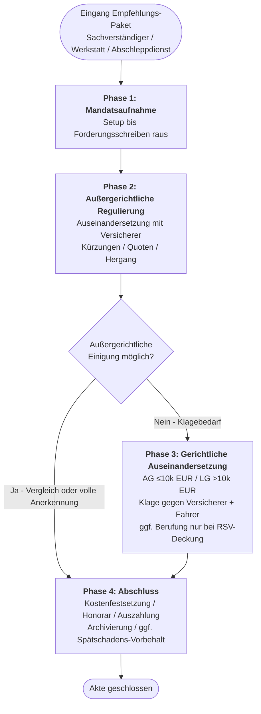
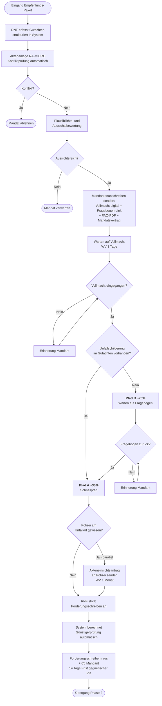
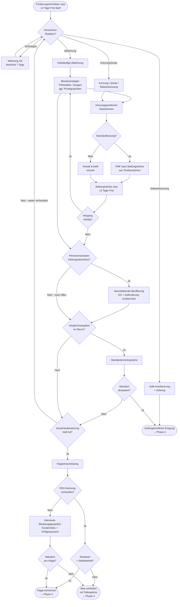

# Workflow Unfallregulierung – Ablaufplan

**Stand:** 25.04.2026
**Kanzleicharakteristik:** ca. 1.000 Unfälle/Jahr, ~90% Empfehlung über Sachverständige/Werkstätten/Abschleppdienste, OWi-Bereich separat automatisiert.

---

## Übersicht – Gesamtprozess

---

## Phase 1: Mandatsaufnahme

**Phasenende:** Versendung Forderungsschreiben an gegnerische Haftpflicht.

**Kerndokumente Eingang:** Sachverständigengutachten, Mandanten-Stammdaten, Fahrzeugdaten, Unfalldaten, ggf. Polizei-Tagebuchnummer, Reparaturkalkulation, Fotos. Vom Mandanten: Vollmacht, Online-Fragebogen, ärztliche Atteste (bei PS), Belege.

**Kerndokumente Ausgang:** Mandantenpaket (Vollmacht/Fragebogen/FAQ/Mandatsvertrag), Akteneinsichtsantrag (bei Polizeibeteiligung), Forderungsschreiben mit anwaltlicher Erstmeldung an gegnerische Haftpflicht inkl. Gutachten und Vollmacht.

**Wichtige Fristen:** Vollmacht 3 Tage WV, Akteneinsicht 1 Monat WV, Antwort gegnerischer VR 14 Tage WV.

**Besonderheit Personenschaden:** Schmerzensgeldvorschuss ist bereits im Forderungsschreiben beziffert, sofern Personenschaden bekannt.

---

## Phase 2: Außergerichtliche Regulierung

**Phasenstart:** Forderungsschreiben raus. **Phasenende:** Außergerichtliche Einigung oder Klageeinreichung.

**Kerndokumente Eingang:** Versicherer-Schreiben (Anerkennung/Kürzung/Ablehnung/Vergleichsangebot), Polizeiakte, Belege Mandant (Reparatur, Mietwagen, Atteste, AU, Verdienstnachweise, Heilungsabschluss-Bestätigung, Wiederbeschaffungsnachweis), RSV-Deckungszusage.

**Kerndokumente Ausgang:** Stellungnahmen mit Textbausteinen (Standardkürzungen) oder Einzelfertigung (atypisch), Mahnungen, Bezifferung Personenschaden (Vorschuss → abschließend), Geltendmachung Nutzungsausfall **und** Restwertdifferenz (parallele Schadenspositionen), Vergleichsannahme/-ablehnung/-gegenvorschlag, RSV-Deckungsanfrage bei Klagebedarf, Klageandrohung.

**Typische Kürzungspositionen mit Textbausteinen:** Stundensätze, UPE/Verbringung, Wertminderung, Restwert-Höchstgebot, Mietwagen-Klassenrückstufung, Nutzungsausfall-Dauer, Sachverständigenkosten, Unkostenpauschale, 130%-Regel, Schmerzensgeld-Höhe, Verdienstausfall, Haushaltsführungsschaden, Mitverschuldensquote.

**Wichtige Fristen:** Versicherer-Antwort 14 Tage, Mahnung 7 Tage Nachfrist, Polizei-Akteneinsicht 1 Monat WV, RSV-Deckungszusage 14 Tage WV, Heilungsverlauf-WV 4-8 Wochen je nach Verletzung, Verjährung 3 Jahre (§§ 195, 199 BGB).

---

## Phase 3: Gerichtliche Auseinandersetzung (verbal)

**Phasenstart:** Klageeinreichung über beA. **Phasenende:** Rechtskräftiges Urteil oder gerichtlicher Vergleich.

**Kernschritte:**
1. Klagevorbereitung – Streitwert, Gericht (AG ≤10k / LG >10k EUR), Beklagte (Versicherer **und** Fahrer als Gesamtschuldner gem. §§ 115 VVG, 7/18 StVG, 823 BGB), Beweismittelsortierung
2. Klageschrift mit bezifferten Anträgen inkl. vorgerichtlicher Anwaltskosten als eigene Schadensposition (1,3 Geschäftsgebühr aus berechtigter Forderung)
3. Klagezustellung, Verteidigungsanzeige Beklagter (2 Wochen), Klageerwiderung (weitere 2 Wochen)
4. Replik auf Klageerwiderung
5. Beweisaufnahme: bei streitiger Haftung Sachverständigengutachten zur Unfallrekonstruktion, bei streitiger Höhe technisches/medizinisches Sachverständigengutachten, Zeugenvernehmung, Parteivernehmung – bei kombiniertem Streit (Standard in der Praxis) parallel mehrere Gutachten
6. Stellungnahmen zu Sachverständigengutachten, Ergänzungsfragen
7. Mündliche Verhandlung(en), Vergleichsversuche durch Gericht (häufig)
8. Urteil: Klageabweisung / Teilstattgabe / Vollstattgabe
9. Berufungsentscheidung: **nur bei RSV-Deckung** wird Berufung eingelegt, ohne Deckung keine Berufung unabhängig von Beschwerhöhe; Berufungsfrist 1 Monat ab Zustellung (kritische Frist), Berufungsbegründung 2 Monate

**Strukturelle Besonderheit OLG-Bezirk Frankfurt:** Keine spezialisierten Verkehrsrechtskammern. Konsequenz: Schadenspositionen sorgfältig mit BGH-/OLG-Rechtsprechung begründen, Sachverständigenbeweis zur Höhe oft notwendig auch bei eigentlich klaren Standardthemen.

**Kerndokumente Eingang:** Gerichtsverfügungen, Klageerwiderung Beklagter, Beweisbeschluss, Sachverständigengutachten, Verhandlungsprotokolle, Urteil, Kostenfestsetzungsbeschluss, RSV-Deckungszusagen pro Instanz.

**Kerndokumente Ausgang:** Klageschrift, Replik, Stellungnahmen zu Sachverständigengutachten, Beweisanträge, Ergänzungsfragen, Vergleichsanträge, Berufungsschrift (bei RSV-Deckung), RSV-Kostennachweise.

**Typische Klagegründe in der Praxis:** Kürzungen oder Haftungseinwendungen, am häufigsten beides parallel.

**Typische Phasendauer:** AG ohne komplexe Beweisaufnahme 6-12 Monate, LG mit Sachverständigengutachten 12-24 Monate, kombinierter Haftungs- und Höhenstreit 18-36 Monate, Berufung OLG Frankfurt 12-18 Monate zusätzlich.

---

## Phase 4: Abschluss (verbal)

**Phasenstart:** Außergerichtliche Einigung, gerichtlicher Vergleich, rechtskräftiges Urteil oder Mandantenentscheidung gegen weitere Verfolgung.

**Kernschritte:**
1. Klärung Forderungstitel (Vergleichsvereinbarung schriftlich / Rechtskraftbestätigung / vollstreckbare Ausfertigung)
2. Zahlungsabwicklung gegnerischer Versicherer auf Anwaltskonto, Fremdgeldverbuchung
3. Kostenfestsetzungsverfahren (bei gerichtlichem Verfahren)
4. Honorarabrechnung nach RVG: vorgerichtliche Geschäftsgebühr (Nr. 2300 VV), gerichtliche Verfahrensgebühr (Nr. 3100), Terminsgebühr (Nr. 3104), ggf. Einigungsgebühr (Nr. 1003), Anrechnung 0,65 vorgerichtlich auf gerichtlich
5. Auszahlung Mandant (Eingang minus Honorar/Auslagen)
6. Vollstreckung bei Nichtzahlung – praktisch nur gegen Fahrer relevant (Versicherer zahlen titulierte Forderungen), hier Bonitätsprüfung vorab zur Sinnhaftigkeitsbewertung
7. Aktenschließung: Originalrückgabe auf Wunsch, Aufbewahrung 6 Jahre Standard / 10 Jahre bei Personenschaden
8. Mandanten-Abschlussschreiben mit Endabrechnung und Belehrungen, bei Personenschaden Hinweis auf Spätschadens-Verjährung (30 Jahre nach § 199 II BGB)
9. Empfehlungsgeber-Rückmeldung (CRM, optional)
10. Bei Vorbehalt für Spätschäden: Akte als ruhend mit Wiedervorlage-Periodik

**Kerndokumente Eingang:** Rechtskraftbescheinigung, Kostenfestsetzungsbeschluss, vollstreckbare Ausfertigung, Auszahlungsbestätigung Versicherer, RSV-Schlussabrechnung, ggf. Spätschadensanmeldung Mandant.

**Kerndokumente Ausgang:** Endabrechnung Honorar, Auszahlungsmitteilung, Mandanten-Abschlussschreiben, Kostenfestsetzungsantrag, RSV-Schlussabrechnung mit Kostennachweisen vollständig, ggf. Vollstreckungsanträge gegen Fahrer.

**Typische Phasendauer:** Standardabschluss bei freiwilliger Zahlung 4-6 Wochen, mit Kostenfestsetzung 8-12 Wochen, mit Vollstreckung gegen Fahrer mehrere Monate bis Jahre, Spätschadenakten bis zu 30 Jahre Verjährungsende.

---

## Querliegende Themen

**Eigenentwicklung Forderungssystem:** Über Jahre bewährte Eigenentwicklung mit automatischer Günstigerprüfung. Forderungsschreiben wird durch RNF nur angestoßen, System generiert vollständig inkl. Personenschaden-Bezifferung.

**Textbausteine Kürzungen:** Für jede einzelne Kürzungsposition existiert ein Textbaustein. RNF baut Stellungnahmen selbständig zusammen, Anwalt nur bei atypischen Konstellationen oder strategischen Weichen eingebunden.

**RSV-Logik:** Deckungsanfrage erst bei Klagebedarf (nicht in Phase 1). Mit Deckung: Klage Standard außer Streitwert < Selbstbehalt. Ohne Deckung: intensives Beratungsgespräch mit Mandantenentscheidung. Berufung ausschließlich bei RSV-Deckung.

**Strafanzeige:** Keine routinemäßige Strafanzeige. Nur auf expliziten Mandantenwunsch.

**Nutzungsausfall und Restwertdifferenz:** Eigenständige Schadenspositionen ohne inneren Zusammenhang, parallele Geltendmachung möglich und üblich.
